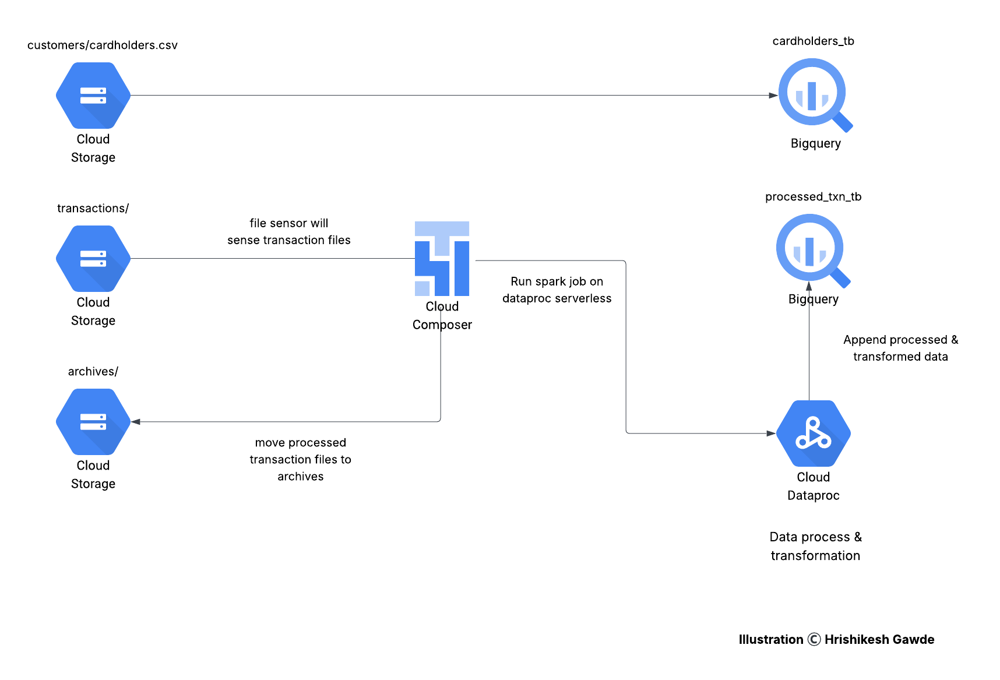

# Credit Card Transaction Analysis for Fraud Risk

## Introduction
This project demonstrates a modern, automated ETL pipeline built to analyze credit card transactions for fraud detection and risk scoring. It leverages Google Cloud Platform (GCP) services, PySpark, and CI/CD practices to create a production-grade data engineering workflow, with a special focus on automation, testing, and orchestration.

## Problem Statement
Banks and financial institutions need to detect fraudulent activity in real-time while managing large volumes of transactions. Traditional systems often rely on batch-based analysis and lack automation and robustness for production environments. This project solves that by implementing a scalable, testable, and automated data pipeline to detect fraud risk and generate actionable insights from transactional data.

## Architecture

## Technology Used
- Python
- PySpark
- Google Cloud Storage
- Google Cloud Dataproc (Serverless)
- Google Cloud Composer (Airflow)
- Google BigQuery
- PyTest
- GitHub
- GitHub Actions (CI/CD)

## Dataset Used
#### Input Data
- cardholders.csv: cardholder_id, customer_name, reward_points, risk_score
- transactions_YYYY_MM_DD.json: transaction_id, cardholder_id, merchant_id, merchant_name, merchant_category, transaction_amount, transaction_currency, transaction_timestamp, transaction_status, fraud_flag, device_type, merchant_location

#### Output Table
- processed_txn_tb: transaction_id, cardholder_id, merchant_id, merchant_name, merchant_category, transaction_amount, transaction_currency, transaction_timestamp, transaction_status, fraud_flag, device_type, merchant_location, transaction_category, is_high_risk, fraud_risk_level, updated_reward_points

## Scripts for Project
#### spark_job.py: 
PySpark application that performs data validation and transformation. Derives fields like: transaction_category (low, medium, high), is_high_risk (true/false), fraud_risk_level (low, high, critical), updated_reward_points (post-transaction calculation)

#### airflow_job.py: 
Airflow DAG that:
- Senses new transactional JSON files from Cloud Storage
- Triggers the PySpark job on Dataproc Serverless
- Moves processed files to the archive folder to prevent reprocessing
- test_transactions_processing.py: Unit tests for PySpark application logic, validating transformation and business logic using PyTest.

#### requirements.txt
A simple text file that lists all the Python packages (libraries, modules) and their specific versions needed for a project
#### .github/workflows/ci-cd.yaml:
GitHub Actions workflow that:
- Runs tests using PyTest on dev branch
- Deploys Airflow DAG and Spark job to GCS on main branch

## Output 
- Enriched transactional data stored in BigQuery (processed_txn_tb)
- Automated risk scoring and reward point adjustment per transaction
- Derived business-level insights:
  - Categorization of transactions based on amount
  - Identification of high-risk transactions and fraudulent patterns
  - Updated customer rewards post each transaction
- Prevents reprocessing of files by archiving after execution

## Buisness Impact 
The derived metrics from this pipeline provide actionable insights for fraud detection and customer engagement. The `transaction_category` helps segment transactions into low, medium, or high-value tiers, enabling better monitoring of high-risk financial activities. The `is_high_risk` flag highlights potentially suspicious transactions based on risk thresholds, allowing faster intervention. The `fraud_risk_level` (low, high, critical) enables fraud teams to prioritize investigations based on severity, enhancing operational efficiency. Finally, `updated_reward_points` allows dynamic reward point adjustments, ensuring customer loyalty programs remain accurate and responsive to user behavior. Collectively, these enriched features empower financial institutions to improve fraud detection, reduce false positives, enhance customer trust, and optimize reward strategies.

## My Learnings
- Implementing real-world ETL orchestration using Cloud Composer (Airflow)
- Writing PySpark applications with robust business logic and validations
- Creating unit tests for Spark using PyTest
- Deploying production pipelines using GitHub Actions CI/CD workflows
- Working with Dataproc Serverless for scalable job execution
- Designing a complete automated workflow with staging and production environments

